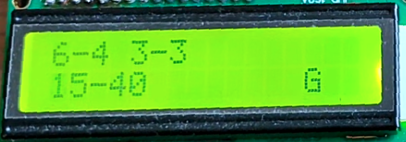

## Tennis Scoreboard Simulator

I have made few additions to the problem statement.
I feel that these additions doens't change or add any logic/features that are not required.
These features are what I feel 'necessary' and/or are good programming practices.

## Demo Video

<video width="70%" controls>  <source src="tennis demo.mp4" type="video/mp4">Your browser does not support the video tag.</video>

[The Scoring System](https://www.tennistips.org/tennis-scoring-system/)

Following additions are made to the project

- Reset button ('r','R') to start the game again
- Instructions available on terminal by pressing 'i' or 'I'
- Terminal and LCD prints "Tennis Scoreboard Simulator"
- Terminal prints back the character we send to Pt-51
- Terminal also prints the winner "P1 wins" or "P2 wins" accordingly
- Terminal notifies when a character other than '1','2','r' or 'R', 'i' or 'I' is typed
- Handling overflow of tiebreaker points from 3 digits
- Game Points, Set Points, Match Points shown on first line for Player 1 and second line for Player 2